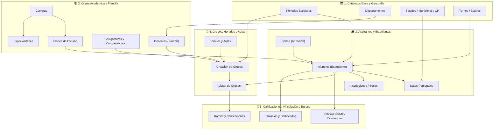
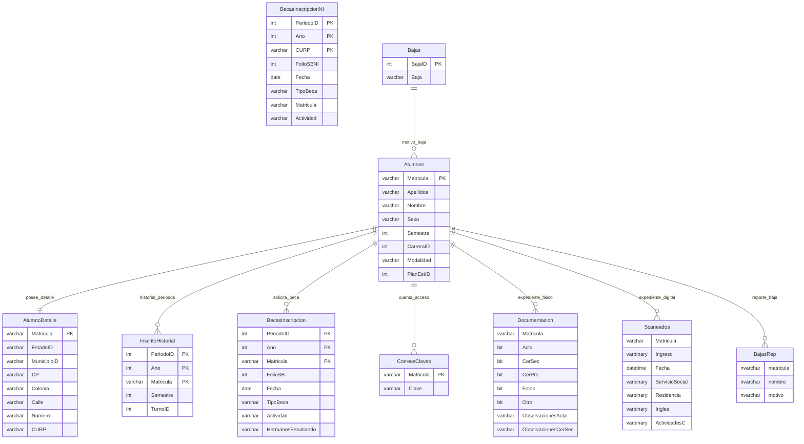
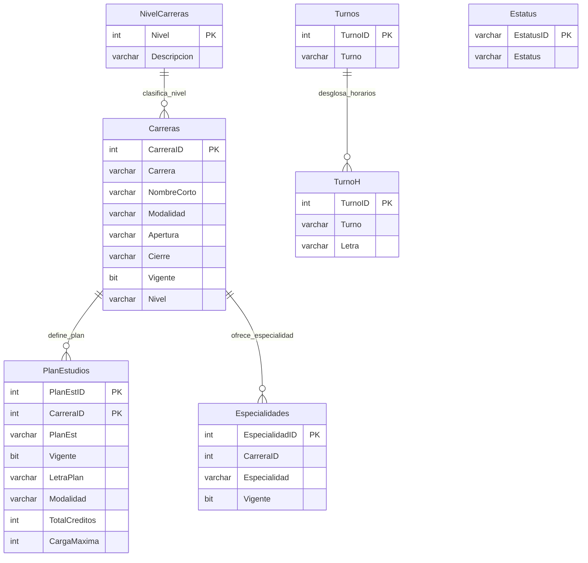
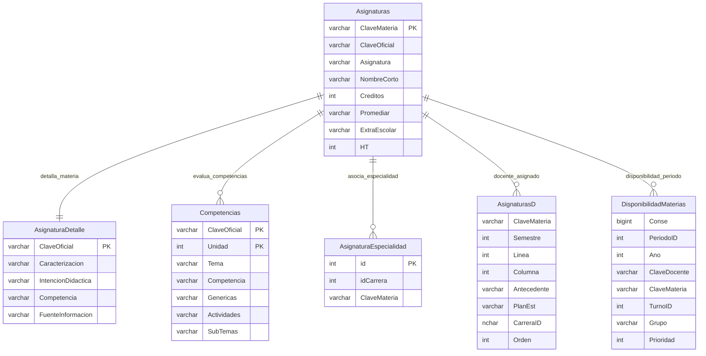
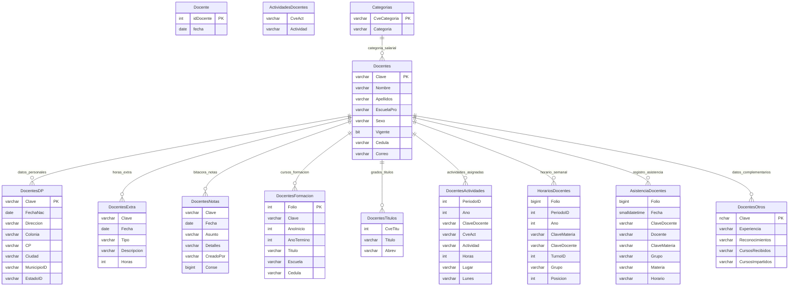
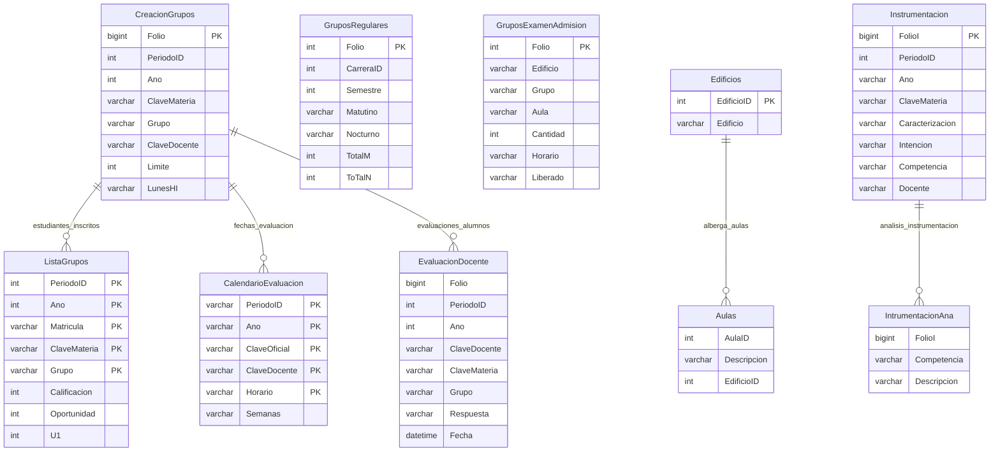
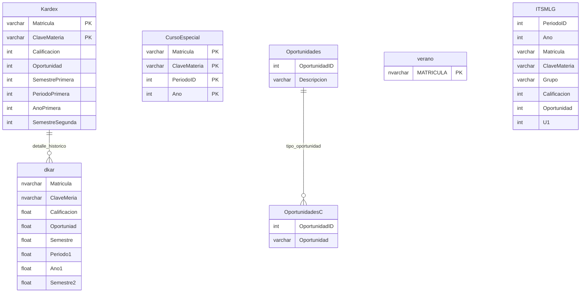
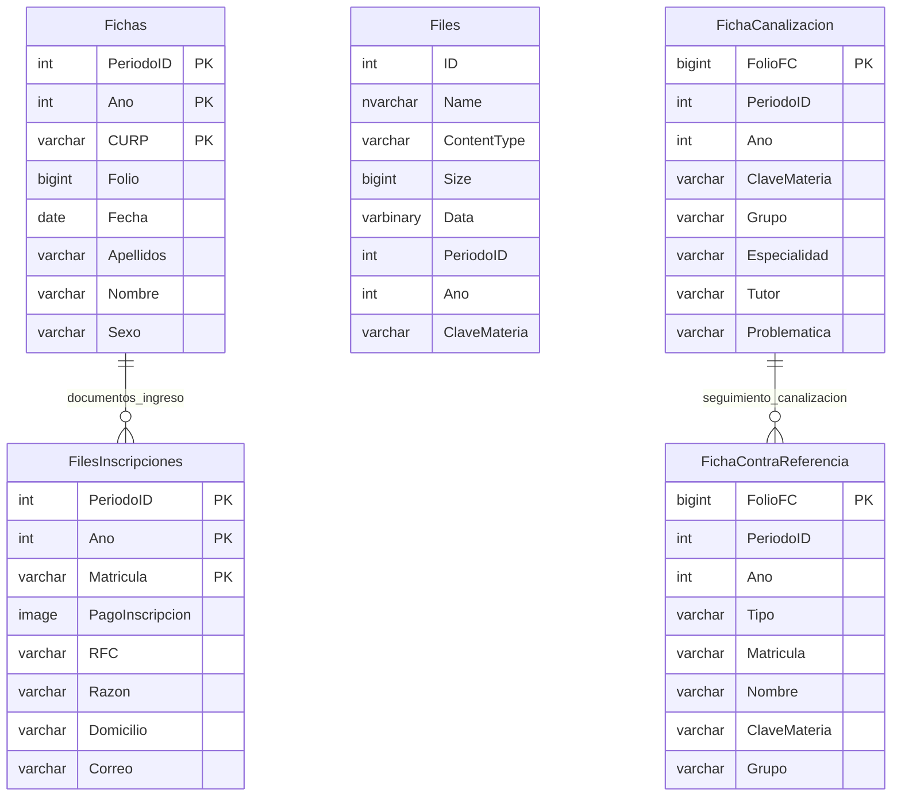
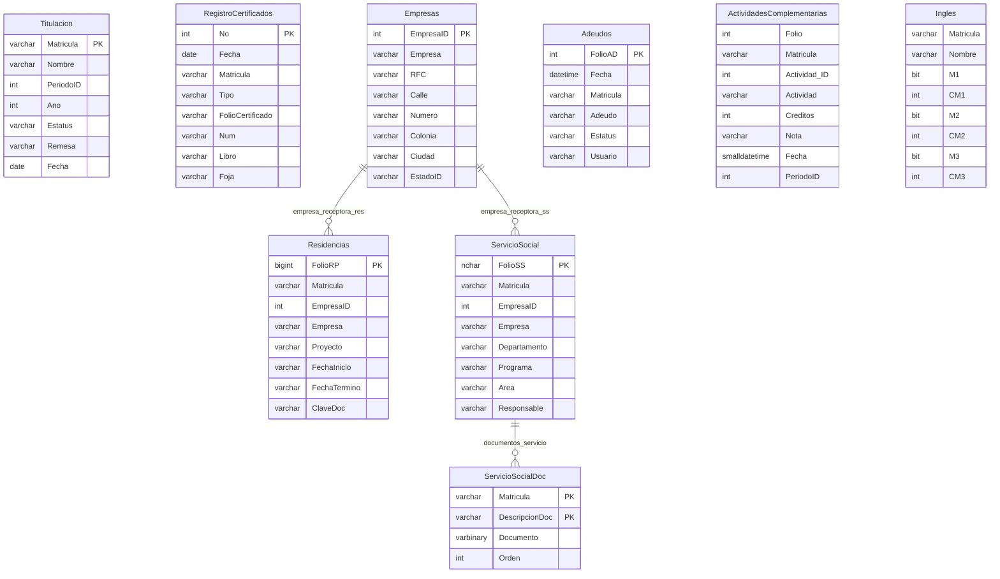
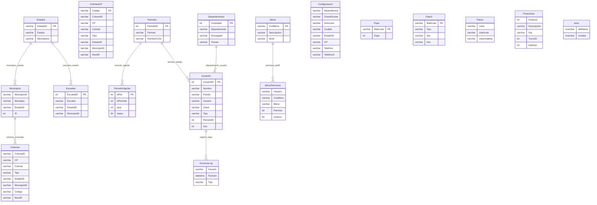

# Esquema de Base de Datos TecNM (85 Tablas)

Este documento documenta y visualiza la arquitectura integral de la base de datos extraída de [estructura_tablas.sql](file:///home/zurita/dev/TecNM_Project_Template/estructura_tablas.sql) (origen: [scriptAlumnosTEC.sql](file:///home/zurita/dev/TecNM_Project_Template/scriptAlumnosTEC.sql)).

> [!NOTE]
> La base de datos contiene **85 tablas** organizadas en **9 módulos funcionales** para permitir una visualización clara, modular y de alto rendimiento mediante diagramas **Mermaid**.

## Diagrama de Arquitectura Global de Módulos

El siguiente diagrama ilustra la interacción y flujo de datos entre los dominios principales del sistema:

## Diagramas Detallados por Módulo (Entity-Relationship)

### 1. Control Escolar y Estudiantes (Alumnos)

Gestión del expediente estudiantil, inscripciones periódicas, bajas, becas, credenciales y documentación probatoria.

| Tabla | Llave Primaria (PK) | Columnas | Descripción Funcional |
| :--- | :--- | :---: | :--- |
| `Alumnos` | `Matricula` | 32 | Catálogo principal de alumnos matriculados con su estatus académico. |
| `AlumnoDetalle` | `Matricula` | 41 | Datos personales, médicos, socioeconómicos y de procedencia del alumno. |
| `InscritoHistorial` | `PeriodoID, Ano, Matricula` | 5 | Registro cronológico del estatus de inscripción del alumno periodo a periodo. |
| `BecasInscripcion` | `PeriodoID, Ano, Matricula` | 44 | Solicitudes y estudios socioeconómicos para beca de inscripción (reingreso). |
| `BecasInscripcionNI` | `PeriodoID, Ano, CURP` | 61 | Solicitudes de beca de inscripción para aspirantes de Nuevo Ingreso. |
| `Bajas` | `BajaID` | 2 | Catálogo de motivos y tipos de baja escolar (temporal, definitiva). |
| `BajasRep` | `*Sin PK explícita*` | 3 | Historial y reportes de bajas aplicadas a estudiantes. |
| `CorreosClaves` | `Matricula` | 2 | Registro de correos institucionales y claves de acceso de alumnos. |
| `Documentacion` | `*Sin PK explícita*` | 20 | Lista de documentos oficiales entregados en el expediente del alumno. |
| `Scaneados` | `*Sin PK explícita*` | 7 | Control de escaneos y digitalizaciones de documentos del estudiante. |

---

### 2. Oferta Académica, Carreras y Planes de Estudio

Catálogo de oferta educativa, niveles académicos, planes curriculares y especialidades disponibles por carrera.

| Tabla | Llave Primaria (PK) | Columnas | Descripción Funcional |
| :--- | :--- | :---: | :--- |
| `Carreras` | `CarreraID` | 13 | Catálogo de programas académicos y carreras profesionales ofertadas. |
| `NivelCarreras` | `Nivel` | 2 | Niveles de estudio ofertados (Licenciatura, Posgrado, etc.). |
| `PlanEstudios` | `PlanEstID, CarreraID` | 13 | Planes curriculares oficiales por carrera y modalidad. |
| `Especialidades` | `EspecialidadID` | 4 | Especialidades técnicas o terminales por carrera profesional. |
| `Turnos` | `TurnoID` | 2 | Catálogo de turnos escolares (Matutino, Vespertino, Mixto). |
| `TurnoH` | `TurnoID` | 3 | Catálogo extendido de turnos escolares con letra distintiva. |
| `Estatus` | `EstatusID` | 2 | Catálogo de estatus académico del alumno (Activo, Baja, Egresado, etc.). |

---

### 3. Asignaturas y Competencias

Estructura curricular de materias, competencias de aprendizaje, disponibilidad y asignación por especialidad.

| Tabla | Llave Primaria (PK) | Columnas | Descripción Funcional |
| :--- | :--- | :---: | :--- |
| `Asignaturas` | `ClaveMateria` | 14 | Catálogo general de materias del plan de estudios con horas y créditos. |
| `AsignaturaDetalle` | `ClaveOficial` | 5 | Datos descriptivos y oficiales extendidos de las asignaturas. |
| `AsignaturaEspecialidad` | `id` | 3 | Mapeo de asignaturas que pertenecen a una especialidad de carrera. |
| `AsignaturasD` | `*Sin PK explícita*` | 11 | Asignación de materias específicas por docente. |
| `Competencias` | `ClaveOficial, Unidad` | 7 | Competencias específicas a evaluar por unidad temática de asignatura. |
| `DisponibilidadMaterias` | `*Sin PK explícita*` | 8 | Oferta de asignaturas habilitadas para selección en el periodo. |

---

### 4. Docentes y Personal Académico

Plantilla de profesores, categorías laborales, datos personales, historial de formación, actividades complementarias y horarios.

| Tabla | Llave Primaria (PK) | Columnas | Descripción Funcional |
| :--- | :--- | :---: | :--- |
| `Docentes` | `Clave` | 24 | Padrón maestro de docentes con datos oficiales, RFC, CURP y categoría. |
| `Docente` | `idDocente` | 2 | Catálogo auxiliar o simplificado de docentes. |
| `DocentesDP` | `Clave` | 11 | Datos personales extendidos y de contacto del profesor. |
| `DocentesExtra` | `*Sin PK explícita*` | 5 | Registro de horas extraordinarias o adicionales del docente. |
| `DocentesNotas` | `*Sin PK explícita*` | 6 | Bitácora de incidencias, notas administrativas o avisos sobre el docente. |
| `DocentesOtros` | `Clave` | 5 | Información laboral complementaria del docente. |
| `DocentesTitulos` | `*Sin PK explícita*` | 3 | Grados académicos y títulos profesionales obtenidos por el docente. |
| `DocentesFormacion` | `Folio` | 7 | Cursos de actualización y formación pedagógica/profesional del docente. |
| `DocentesActividades` | `*Sin PK explícita*` | 15 | Actividades de apoyo a la docencia y horas asignadas al profesor. |
| `ActividadesDocentes` | `*Sin PK explícita*` | 2 | Catálogo de actividades de apoyo a la docencia asignables al profesor. |
| `AsistenciaDocentes` | `*Sin PK explícita*` | 24 | Registro diario de asistencia y checador de docentes. |
| `Categorias` | `CveCategoria` | 2 | Categorías laborales y tabulador salarial del personal docente. |
| `HorariosDocentes` | `*Sin PK explícita*` | 10 | Desglose horario detallado de disponibilidad y clases del profesor. |

---

### 5. Grupos, Horarios, Aulas y Evaluación Docente

Apertura de grupos por periodo, asignación de aulas/horarios, listas de alumnos, instrumentación didáctica y evaluación docente.

| Tabla | Llave Primaria (PK) | Columnas | Descripción Funcional |
| :--- | :--- | :---: | :--- |
| `CreacionGrupos` | `Folio` | 45 | Catálogo maestro de grupos abiertos con docente, horario semanal y aula. |
| `GruposRegulares` | `Folio` | 7 | Catálogo de referencia de grupos estándar creados por periodo. |
| `GruposExamenAdmision` | `Folio` | 7 | Grupos y aulas asignados para la aplicación del examen de admisión. |
| `ListaGrupos` | `PeriodoID, Ano, Matricula, ClaveMateria, Grupo` | 61 | Alumnos inscritos en cada grupo con calificaciones por unidad y faltas. |
| `Aulas` | `*Sin PK explícita*` | 3 | Salones y espacios físicos de clase asignados a un edificio. |
| `Edificios` | `EdificioID` | 2 | Catálogo de edificios e instalaciones físicas del campus. |
| `CalendarioEvaluacion` | `PeriodoID, Ano, ClaveOficial, ClaveDocente, Horario` | 6 | Fechas programadas de exámenes y evaluaciones por materia y docente. |
| `EvaluacionDocente` | `*Sin PK explícita*` | 10 | Respuestas y resultados de la evaluación docente contestada por alumnos. |
| `Instrumentacion` | `FolioI` | 8 | Registro de instrumentaciones didácticas entregadas por materia y profesor. |
| `IntrumentacionAna` | `*Sin PK explícita*` | 3 | Análisis y seguimiento colegiado de la instrumentación didáctica. |

---

### 6. Calificaciones, Kardex y Cursos Especiales

Historial académico definitivo (Kardex), cursos de repetición/especiales, oportunidades de evaluación y cursos de verano.

| Tabla | Llave Primaria (PK) | Columnas | Descripción Funcional |
| :--- | :--- | :---: | :--- |
| `Kardex` | `Matricula, ClaveMateria` | 20 | Historial oficial de materias cursadas, calificaciones y oportunidades por alumno. |
| `dkar` | `*Sin PK explícita*` | 20 | Tabla auxiliar de cálculo o migración de kardex. |
| `CursoEspecial` | `Matricula, ClaveMateria, PeriodoID, Ano` | 4 | Registro de alumnos cursando materias en modalidad especial o repetición. |
| `Oportunidades` | `*Sin PK explícita*` | 2 | Catálogo de tipos de oportunidad de acreditación (Ordinario, Regularización). |
| `OportunidadesC` | `*Sin PK explícita*` | 2 | Clases o modalidades de oportunidad complementarias. |
| `verano` | `MATRICULA` | 1 | Padrón de alumnos inscritos en cursos de verano. |
| `ITSMLG` | `*Sin PK explícita*` | 62 | Tabla auxiliar o registro masivo de calificaciones de lista de grupos. |

---

### 7. Admisión, Fichas de Aspirantes e Inscripciones

Registro de aspirantes (fichas de examen), validación de documentación digital de nuevo ingreso y canalización.

| Tabla | Llave Primaria (PK) | Columnas | Descripción Funcional |
| :--- | :--- | :---: | :--- |
| `Fichas` | `PeriodoID, Ano, CURP` | 66 | Padrón de aspirantes a nuevo ingreso con ficha de examen. |
| `FilesInscripciones` | `PeriodoID, Ano, Matricula` | 13 | Comprobantes de pago y archivos digitales de inscripción por periodo. |
| `Files` | `*Sin PK explícita*` | 10 | Archivos digitales y binarios almacenados en la base de datos. |
| `FichaCanalizacion` | `FolioFC` | 14 | Canalización de alumnos a tutoría, apoyo psicológico o asesoría académica. |
| `FichaContraReferencia` | `FolioFC` | 22 | Seguimiento, resolución y cierre de canalizaciones estudiantiles. |

---

### 8. Trámites de Egreso, Vinculación y Titulación

Servicio Social, Residencias Profesionales en empresas, acreditación de inglés/complementarias, titulación y entrega de certificados.

| Tabla | Llave Primaria (PK) | Columnas | Descripción Funcional |
| :--- | :--- | :---: | :--- |
| `Residencias` | `FolioRP` | 12 | Expediente del proyecto de Residencia Profesional del alumno en empresa. |
| `ServicioSocial` | `FolioSS` | 16 | Expediente de asignación y acreditación de Servicio Social del alumno. |
| `ServicioSocialDoc` | `Matricula, DescripcionDoc` | 4 | Documentos y reportes bimestrales probatorios de servicio social. |
| `Titulacion` | `Matricula` | 7 | Control de trámites, modalidad de titulación y acto recepcional. |
| `RegistroCertificados` | `No` | 8 | Libro y folio de registro de certificados de terminación de estudios. |
| `Empresas` | `EmpresaID` | 16 | Directorio de empresas vinculadas para residencias y servicio social. |
| `Adeudos` | `FolioAD` | 6 | Control de adeudos de material, libros o financieros del alumno. |
| `ActividadesComplementarias` | `*Sin PK explícita*` | 10 | Registro de créditos por actividades complementarias (culturales, deportivas, académicas). |
| `Ingles` | `*Sin PK explícita*` | 22 | Registro de acreditación y niveles del idioma inglés por alumno. |

---

### 9. Catálogos Geográficos, Seguridad y Sistema

Parámetros institucionales, estructura geográfica (estados/municipios/colonias), periodos vigentes, usuarios del sistema, accesos y permisos de menú.

| Tabla | Llave Primaria (PK) | Columnas | Descripción Funcional |
| :--- | :--- | :---: | :--- |
| `Estados` | `EstadoID` | 3 | Catálogo de entidades federativas (estados de la república). |
| `Municipios` | `*Sin PK explícita*` | 4 | Catálogo de municipios del país asociados a los estados. |
| `Colonias` | `*Sin PK explícita*` | 8 | Catálogo de colonias asociadas a municipios. |
| `ColoniasCP` | `Codigo` | 8 | Códigos postales con asentamiento, municipio y estado. |
| `Escuelas` | `EscuelaID` | 4 | Catálogo de preparatorias y escuelas de procedencia de los aspirantes. |
| `Periodos` | `PeriodoID` | 3 | Catálogo maestro de periodos semestrales escolares. |
| `PeriodoVigente` | `idPer` | 4 | Indicador del periodo escolar activo y vigente en el ciclo actual. |
| `Departamentos` | `CveDepto` | 4 | Departamentos administrativos y académicos de la institución. |
| `Usuarios` | `UsuarioID` | 10 | Cuentas de usuario del personal con rol y adscripción a departamento. |
| `AccesosLog` | `*Sin PK explícita*` | 3 | Bitácora de accesos al sistema con fecha, IP y usuario. |
| `Menu` | `CveMenu` | 3 | Catálogo de módulos, pantallas y opciones del menú del sistema. |
| `MenuPermisos` | `*Sin PK explícita*` | 5 | Matriz de permisos de acceso al menú por perfil de usuario. |
| `Configuracion` | `*Sin PK explícita*` | 36 | Parámetros globales y variables de operación del sistema. |
| `Paso` | `Matricula` | 2 | Tabla auxiliar para control de fases o pasos de reinscripción/titulación. |
| `Paso2` | `Matricula` | 4 | Tabla auxiliar para la segunda fase de procesos escolares. |
| `Pasos` | `*Sin PK explícita*` | 3 | Catálogo de pasos o etapas de flujos del sistema. |
| `Posiciones` | `*Sin PK explícita*` | 5 | Catálogo de cargos, posiciones o puestos institucionales. |
| `enec` | `*Sin PK explícita*` | 2 | Tabla auxiliar de configuración o encuestas institucionales. |

---

## Índice Alfabético Completo de las 85 Tablas

| # | Nombre de Tabla | Módulo / Dominio | Llave Primaria (PK) | N° Columnas | Descripción |
| :---: | :--- | :--- | :--- | :---: | :--- |
| 1 | [`AccesosLog`](file:///home/zurita/dev/TecNM_Project_Template/estructura_tablas.sql) | Catálogos Geográficos, Seguridad y Sistema | `*Sin PK explícita*` | 3 | Bitácora de accesos al sistema con fecha, IP y usuario. |
| 2 | [`ActividadesComplementarias`](file:///home/zurita/dev/TecNM_Project_Template/estructura_tablas.sql) | Trámites de Egreso, Vinculación y Titulación | `*Sin PK explícita*` | 10 | Registro de créditos por actividades complementarias (culturales, deportivas, académicas). |
| 3 | [`ActividadesDocentes`](file:///home/zurita/dev/TecNM_Project_Template/estructura_tablas.sql) | Docentes y Personal Académico | `*Sin PK explícita*` | 2 | Catálogo de actividades de apoyo a la docencia asignables al profesor. |
| 4 | [`Adeudos`](file:///home/zurita/dev/TecNM_Project_Template/estructura_tablas.sql) | Trámites de Egreso, Vinculación y Titulación | `FolioAD` | 6 | Control de adeudos de material, libros o financieros del alumno. |
| 5 | [`AlumnoDetalle`](file:///home/zurita/dev/TecNM_Project_Template/estructura_tablas.sql) | Control Escolar y Estudiantes | `Matricula` | 41 | Datos personales, médicos, socioeconómicos y de procedencia del alumno. |
| 6 | [`Alumnos`](file:///home/zurita/dev/TecNM_Project_Template/estructura_tablas.sql) | Control Escolar y Estudiantes | `Matricula` | 32 | Catálogo principal de alumnos matriculados con su estatus académico. |
| 7 | [`AsignaturaDetalle`](file:///home/zurita/dev/TecNM_Project_Template/estructura_tablas.sql) | Asignaturas y Competencias | `ClaveOficial` | 5 | Datos descriptivos y oficiales extendidos de las asignaturas. |
| 8 | [`AsignaturaEspecialidad`](file:///home/zurita/dev/TecNM_Project_Template/estructura_tablas.sql) | Asignaturas y Competencias | `id` | 3 | Mapeo de asignaturas que pertenecen a una especialidad de carrera. |
| 9 | [`Asignaturas`](file:///home/zurita/dev/TecNM_Project_Template/estructura_tablas.sql) | Asignaturas y Competencias | `ClaveMateria` | 14 | Catálogo general de materias del plan de estudios con horas y créditos. |
| 10 | [`AsignaturasD`](file:///home/zurita/dev/TecNM_Project_Template/estructura_tablas.sql) | Asignaturas y Competencias | `*Sin PK explícita*` | 11 | Asignación de materias específicas por docente. |
| 11 | [`AsistenciaDocentes`](file:///home/zurita/dev/TecNM_Project_Template/estructura_tablas.sql) | Docentes y Personal Académico | `*Sin PK explícita*` | 24 | Registro diario de asistencia y checador de docentes. |
| 12 | [`Aulas`](file:///home/zurita/dev/TecNM_Project_Template/estructura_tablas.sql) | Grupos, Horarios, Aulas y Evaluación Docente | `*Sin PK explícita*` | 3 | Salones y espacios físicos de clase asignados a un edificio. |
| 13 | [`Bajas`](file:///home/zurita/dev/TecNM_Project_Template/estructura_tablas.sql) | Control Escolar y Estudiantes | `BajaID` | 2 | Catálogo de motivos y tipos de baja escolar (temporal, definitiva). |
| 14 | [`BajasRep`](file:///home/zurita/dev/TecNM_Project_Template/estructura_tablas.sql) | Control Escolar y Estudiantes | `*Sin PK explícita*` | 3 | Historial y reportes de bajas aplicadas a estudiantes. |
| 15 | [`BecasInscripcion`](file:///home/zurita/dev/TecNM_Project_Template/estructura_tablas.sql) | Control Escolar y Estudiantes | `PeriodoID, Ano, Matricula` | 44 | Solicitudes y estudios socioeconómicos para beca de inscripción (reingreso). |
| 16 | [`BecasInscripcionNI`](file:///home/zurita/dev/TecNM_Project_Template/estructura_tablas.sql) | Control Escolar y Estudiantes | `PeriodoID, Ano, CURP` | 61 | Solicitudes de beca de inscripción para aspirantes de Nuevo Ingreso. |
| 17 | [`CalendarioEvaluacion`](file:///home/zurita/dev/TecNM_Project_Template/estructura_tablas.sql) | Grupos, Horarios, Aulas y Evaluación Docente | `PeriodoID, Ano, ClaveOficial, ClaveDocente, Horario` | 6 | Fechas programadas de exámenes y evaluaciones por materia y docente. |
| 18 | [`Carreras`](file:///home/zurita/dev/TecNM_Project_Template/estructura_tablas.sql) | Oferta Académica, Carreras y Planes de Estudio | `CarreraID` | 13 | Catálogo de programas académicos y carreras profesionales ofertadas. |
| 19 | [`Categorias`](file:///home/zurita/dev/TecNM_Project_Template/estructura_tablas.sql) | Docentes y Personal Académico | `CveCategoria` | 2 | Categorías laborales y tabulador salarial del personal docente. |
| 20 | [`Colonias`](file:///home/zurita/dev/TecNM_Project_Template/estructura_tablas.sql) | Catálogos Geográficos, Seguridad y Sistema | `*Sin PK explícita*` | 8 | Catálogo de colonias asociadas a municipios. |
| 21 | [`ColoniasCP`](file:///home/zurita/dev/TecNM_Project_Template/estructura_tablas.sql) | Catálogos Geográficos, Seguridad y Sistema | `Codigo` | 8 | Códigos postales con asentamiento, municipio y estado. |
| 22 | [`Competencias`](file:///home/zurita/dev/TecNM_Project_Template/estructura_tablas.sql) | Asignaturas y Competencias | `ClaveOficial, Unidad` | 7 | Competencias específicas a evaluar por unidad temática de asignatura. |
| 23 | [`Configuracion`](file:///home/zurita/dev/TecNM_Project_Template/estructura_tablas.sql) | Catálogos Geográficos, Seguridad y Sistema | `*Sin PK explícita*` | 36 | Parámetros globales y variables de operación del sistema. |
| 24 | [`CorreosClaves`](file:///home/zurita/dev/TecNM_Project_Template/estructura_tablas.sql) | Control Escolar y Estudiantes | `Matricula` | 2 | Registro de correos institucionales y claves de acceso de alumnos. |
| 25 | [`CreacionGrupos`](file:///home/zurita/dev/TecNM_Project_Template/estructura_tablas.sql) | Grupos, Horarios, Aulas y Evaluación Docente | `Folio` | 45 | Catálogo maestro de grupos abiertos con docente, horario semanal y aula. |
| 26 | [`CursoEspecial`](file:///home/zurita/dev/TecNM_Project_Template/estructura_tablas.sql) | Calificaciones, Kardex y Cursos Especiales | `Matricula, ClaveMateria, PeriodoID, Ano` | 4 | Registro de alumnos cursando materias en modalidad especial o repetición. |
| 27 | [`Departamentos`](file:///home/zurita/dev/TecNM_Project_Template/estructura_tablas.sql) | Catálogos Geográficos, Seguridad y Sistema | `CveDepto` | 4 | Departamentos administrativos y académicos de la institución. |
| 28 | [`DisponibilidadMaterias`](file:///home/zurita/dev/TecNM_Project_Template/estructura_tablas.sql) | Asignaturas y Competencias | `*Sin PK explícita*` | 8 | Oferta de asignaturas habilitadas para selección en el periodo. |
| 29 | [`Docente`](file:///home/zurita/dev/TecNM_Project_Template/estructura_tablas.sql) | Docentes y Personal Académico | `idDocente` | 2 | Catálogo auxiliar o simplificado de docentes. |
| 30 | [`Docentes`](file:///home/zurita/dev/TecNM_Project_Template/estructura_tablas.sql) | Docentes y Personal Académico | `Clave` | 24 | Padrón maestro de docentes con datos oficiales, RFC, CURP y categoría. |
| 31 | [`DocentesActividades`](file:///home/zurita/dev/TecNM_Project_Template/estructura_tablas.sql) | Docentes y Personal Académico | `*Sin PK explícita*` | 15 | Actividades de apoyo a la docencia y horas asignadas al profesor. |
| 32 | [`DocentesDP`](file:///home/zurita/dev/TecNM_Project_Template/estructura_tablas.sql) | Docentes y Personal Académico | `Clave` | 11 | Datos personales extendidos y de contacto del profesor. |
| 33 | [`DocentesExtra`](file:///home/zurita/dev/TecNM_Project_Template/estructura_tablas.sql) | Docentes y Personal Académico | `*Sin PK explícita*` | 5 | Registro de horas extraordinarias o adicionales del docente. |
| 34 | [`DocentesFormacion`](file:///home/zurita/dev/TecNM_Project_Template/estructura_tablas.sql) | Docentes y Personal Académico | `Folio` | 7 | Cursos de actualización y formación pedagógica/profesional del docente. |
| 35 | [`DocentesNotas`](file:///home/zurita/dev/TecNM_Project_Template/estructura_tablas.sql) | Docentes y Personal Académico | `*Sin PK explícita*` | 6 | Bitácora de incidencias, notas administrativas o avisos sobre el docente. |
| 36 | [`DocentesOtros`](file:///home/zurita/dev/TecNM_Project_Template/estructura_tablas.sql) | Docentes y Personal Académico | `Clave` | 5 | Información laboral complementaria del docente. |
| 37 | [`DocentesTitulos`](file:///home/zurita/dev/TecNM_Project_Template/estructura_tablas.sql) | Docentes y Personal Académico | `*Sin PK explícita*` | 3 | Grados académicos y títulos profesionales obtenidos por el docente. |
| 38 | [`Documentacion`](file:///home/zurita/dev/TecNM_Project_Template/estructura_tablas.sql) | Control Escolar y Estudiantes | `*Sin PK explícita*` | 20 | Lista de documentos oficiales entregados en el expediente del alumno. |
| 39 | [`Edificios`](file:///home/zurita/dev/TecNM_Project_Template/estructura_tablas.sql) | Grupos, Horarios, Aulas y Evaluación Docente | `EdificioID` | 2 | Catálogo de edificios e instalaciones físicas del campus. |
| 40 | [`Empresas`](file:///home/zurita/dev/TecNM_Project_Template/estructura_tablas.sql) | Trámites de Egreso, Vinculación y Titulación | `EmpresaID` | 16 | Directorio de empresas vinculadas para residencias y servicio social. |
| 41 | [`Escuelas`](file:///home/zurita/dev/TecNM_Project_Template/estructura_tablas.sql) | Catálogos Geográficos, Seguridad y Sistema | `EscuelaID` | 4 | Catálogo de preparatorias y escuelas de procedencia de los aspirantes. |
| 42 | [`Especialidades`](file:///home/zurita/dev/TecNM_Project_Template/estructura_tablas.sql) | Oferta Académica, Carreras y Planes de Estudio | `EspecialidadID` | 4 | Especialidades técnicas o terminales por carrera profesional. |
| 43 | [`Estados`](file:///home/zurita/dev/TecNM_Project_Template/estructura_tablas.sql) | Catálogos Geográficos, Seguridad y Sistema | `EstadoID` | 3 | Catálogo de entidades federativas (estados de la república). |
| 44 | [`Estatus`](file:///home/zurita/dev/TecNM_Project_Template/estructura_tablas.sql) | Oferta Académica, Carreras y Planes de Estudio | `EstatusID` | 2 | Catálogo de estatus académico del alumno (Activo, Baja, Egresado, etc.). |
| 45 | [`EvaluacionDocente`](file:///home/zurita/dev/TecNM_Project_Template/estructura_tablas.sql) | Grupos, Horarios, Aulas y Evaluación Docente | `*Sin PK explícita*` | 10 | Respuestas y resultados de la evaluación docente contestada por alumnos. |
| 46 | [`FichaCanalizacion`](file:///home/zurita/dev/TecNM_Project_Template/estructura_tablas.sql) | Admisión, Fichas de Aspirantes e Inscripciones | `FolioFC` | 14 | Canalización de alumnos a tutoría, apoyo psicológico o asesoría académica. |
| 47 | [`FichaContraReferencia`](file:///home/zurita/dev/TecNM_Project_Template/estructura_tablas.sql) | Admisión, Fichas de Aspirantes e Inscripciones | `FolioFC` | 22 | Seguimiento, resolución y cierre de canalizaciones estudiantiles. |
| 48 | [`Fichas`](file:///home/zurita/dev/TecNM_Project_Template/estructura_tablas.sql) | Admisión, Fichas de Aspirantes e Inscripciones | `PeriodoID, Ano, CURP` | 66 | Padrón de aspirantes a nuevo ingreso con ficha de examen. |
| 49 | [`Files`](file:///home/zurita/dev/TecNM_Project_Template/estructura_tablas.sql) | Admisión, Fichas de Aspirantes e Inscripciones | `*Sin PK explícita*` | 10 | Archivos digitales y binarios almacenados en la base de datos. |
| 50 | [`FilesInscripciones`](file:///home/zurita/dev/TecNM_Project_Template/estructura_tablas.sql) | Admisión, Fichas de Aspirantes e Inscripciones | `PeriodoID, Ano, Matricula` | 13 | Comprobantes de pago y archivos digitales de inscripción por periodo. |
| 51 | [`GruposExamenAdmision`](file:///home/zurita/dev/TecNM_Project_Template/estructura_tablas.sql) | Grupos, Horarios, Aulas y Evaluación Docente | `Folio` | 7 | Grupos y aulas asignados para la aplicación del examen de admisión. |
| 52 | [`GruposRegulares`](file:///home/zurita/dev/TecNM_Project_Template/estructura_tablas.sql) | Grupos, Horarios, Aulas y Evaluación Docente | `Folio` | 7 | Catálogo de referencia de grupos estándar creados por periodo. |
| 53 | [`HorariosDocentes`](file:///home/zurita/dev/TecNM_Project_Template/estructura_tablas.sql) | Docentes y Personal Académico | `*Sin PK explícita*` | 10 | Desglose horario detallado de disponibilidad y clases del profesor. |
| 54 | [`ITSMLG`](file:///home/zurita/dev/TecNM_Project_Template/estructura_tablas.sql) | Calificaciones, Kardex y Cursos Especiales | `*Sin PK explícita*` | 62 | Tabla auxiliar o registro masivo de calificaciones de lista de grupos. |
| 55 | [`Ingles`](file:///home/zurita/dev/TecNM_Project_Template/estructura_tablas.sql) | Trámites de Egreso, Vinculación y Titulación | `*Sin PK explícita*` | 22 | Registro de acreditación y niveles del idioma inglés por alumno. |
| 56 | [`InscritoHistorial`](file:///home/zurita/dev/TecNM_Project_Template/estructura_tablas.sql) | Control Escolar y Estudiantes | `PeriodoID, Ano, Matricula` | 5 | Registro cronológico del estatus de inscripción del alumno periodo a periodo. |
| 57 | [`Instrumentacion`](file:///home/zurita/dev/TecNM_Project_Template/estructura_tablas.sql) | Grupos, Horarios, Aulas y Evaluación Docente | `FolioI` | 8 | Registro de instrumentaciones didácticas entregadas por materia y profesor. |
| 58 | [`IntrumentacionAna`](file:///home/zurita/dev/TecNM_Project_Template/estructura_tablas.sql) | Grupos, Horarios, Aulas y Evaluación Docente | `*Sin PK explícita*` | 3 | Análisis y seguimiento colegiado de la instrumentación didáctica. |
| 59 | [`Kardex`](file:///home/zurita/dev/TecNM_Project_Template/estructura_tablas.sql) | Calificaciones, Kardex y Cursos Especiales | `Matricula, ClaveMateria` | 20 | Historial oficial de materias cursadas, calificaciones y oportunidades por alumno. |
| 60 | [`ListaGrupos`](file:///home/zurita/dev/TecNM_Project_Template/estructura_tablas.sql) | Grupos, Horarios, Aulas y Evaluación Docente | `PeriodoID, Ano, Matricula, ClaveMateria, Grupo` | 61 | Alumnos inscritos en cada grupo con calificaciones por unidad y faltas. |
| 61 | [`Menu`](file:///home/zurita/dev/TecNM_Project_Template/estructura_tablas.sql) | Catálogos Geográficos, Seguridad y Sistema | `CveMenu` | 3 | Catálogo de módulos, pantallas y opciones del menú del sistema. |
| 62 | [`MenuPermisos`](file:///home/zurita/dev/TecNM_Project_Template/estructura_tablas.sql) | Catálogos Geográficos, Seguridad y Sistema | `*Sin PK explícita*` | 5 | Matriz de permisos de acceso al menú por perfil de usuario. |
| 63 | [`Municipios`](file:///home/zurita/dev/TecNM_Project_Template/estructura_tablas.sql) | Catálogos Geográficos, Seguridad y Sistema | `*Sin PK explícita*` | 4 | Catálogo de municipios del país asociados a los estados. |
| 64 | [`NivelCarreras`](file:///home/zurita/dev/TecNM_Project_Template/estructura_tablas.sql) | Oferta Académica, Carreras y Planes de Estudio | `Nivel` | 2 | Niveles de estudio ofertados (Licenciatura, Posgrado, etc.). |
| 65 | [`Oportunidades`](file:///home/zurita/dev/TecNM_Project_Template/estructura_tablas.sql) | Calificaciones, Kardex y Cursos Especiales | `*Sin PK explícita*` | 2 | Catálogo de tipos de oportunidad de acreditación (Ordinario, Regularización). |
| 66 | [`OportunidadesC`](file:///home/zurita/dev/TecNM_Project_Template/estructura_tablas.sql) | Calificaciones, Kardex y Cursos Especiales | `*Sin PK explícita*` | 2 | Clases o modalidades de oportunidad complementarias. |
| 67 | [`Paso`](file:///home/zurita/dev/TecNM_Project_Template/estructura_tablas.sql) | Catálogos Geográficos, Seguridad y Sistema | `Matricula` | 2 | Tabla auxiliar para control de fases o pasos de reinscripción/titulación. |
| 68 | [`Paso2`](file:///home/zurita/dev/TecNM_Project_Template/estructura_tablas.sql) | Catálogos Geográficos, Seguridad y Sistema | `Matricula` | 4 | Tabla auxiliar para la segunda fase de procesos escolares. |
| 69 | [`Pasos`](file:///home/zurita/dev/TecNM_Project_Template/estructura_tablas.sql) | Catálogos Geográficos, Seguridad y Sistema | `*Sin PK explícita*` | 3 | Catálogo de pasos o etapas de flujos del sistema. |
| 70 | [`PeriodoVigente`](file:///home/zurita/dev/TecNM_Project_Template/estructura_tablas.sql) | Catálogos Geográficos, Seguridad y Sistema | `idPer` | 4 | Indicador del periodo escolar activo y vigente en el ciclo actual. |
| 71 | [`Periodos`](file:///home/zurita/dev/TecNM_Project_Template/estructura_tablas.sql) | Catálogos Geográficos, Seguridad y Sistema | `PeriodoID` | 3 | Catálogo maestro de periodos semestrales escolares. |
| 72 | [`PlanEstudios`](file:///home/zurita/dev/TecNM_Project_Template/estructura_tablas.sql) | Oferta Académica, Carreras y Planes de Estudio | `PlanEstID, CarreraID` | 13 | Planes curriculares oficiales por carrera y modalidad. |
| 73 | [`Posiciones`](file:///home/zurita/dev/TecNM_Project_Template/estructura_tablas.sql) | Catálogos Geográficos, Seguridad y Sistema | `*Sin PK explícita*` | 5 | Catálogo de cargos, posiciones o puestos institucionales. |
| 74 | [`RegistroCertificados`](file:///home/zurita/dev/TecNM_Project_Template/estructura_tablas.sql) | Trámites de Egreso, Vinculación y Titulación | `No` | 8 | Libro y folio de registro de certificados de terminación de estudios. |
| 75 | [`Residencias`](file:///home/zurita/dev/TecNM_Project_Template/estructura_tablas.sql) | Trámites de Egreso, Vinculación y Titulación | `FolioRP` | 12 | Expediente del proyecto de Residencia Profesional del alumno en empresa. |
| 76 | [`Scaneados`](file:///home/zurita/dev/TecNM_Project_Template/estructura_tablas.sql) | Control Escolar y Estudiantes | `*Sin PK explícita*` | 7 | Control de escaneos y digitalizaciones de documentos del estudiante. |
| 77 | [`ServicioSocial`](file:///home/zurita/dev/TecNM_Project_Template/estructura_tablas.sql) | Trámites de Egreso, Vinculación y Titulación | `FolioSS` | 16 | Expediente de asignación y acreditación de Servicio Social del alumno. |
| 78 | [`ServicioSocialDoc`](file:///home/zurita/dev/TecNM_Project_Template/estructura_tablas.sql) | Trámites de Egreso, Vinculación y Titulación | `Matricula, DescripcionDoc` | 4 | Documentos y reportes bimestrales probatorios de servicio social. |
| 79 | [`Titulacion`](file:///home/zurita/dev/TecNM_Project_Template/estructura_tablas.sql) | Trámites de Egreso, Vinculación y Titulación | `Matricula` | 7 | Control de trámites, modalidad de titulación y acto recepcional. |
| 80 | [`TurnoH`](file:///home/zurita/dev/TecNM_Project_Template/estructura_tablas.sql) | Oferta Académica, Carreras y Planes de Estudio | `TurnoID` | 3 | Catálogo extendido de turnos escolares con letra distintiva. |
| 81 | [`Turnos`](file:///home/zurita/dev/TecNM_Project_Template/estructura_tablas.sql) | Oferta Académica, Carreras y Planes de Estudio | `TurnoID` | 2 | Catálogo de turnos escolares (Matutino, Vespertino, Mixto). |
| 82 | [`Usuarios`](file:///home/zurita/dev/TecNM_Project_Template/estructura_tablas.sql) | Catálogos Geográficos, Seguridad y Sistema | `UsuarioID` | 10 | Cuentas de usuario del personal con rol y adscripción a departamento. |
| 83 | [`dkar`](file:///home/zurita/dev/TecNM_Project_Template/estructura_tablas.sql) | Calificaciones, Kardex y Cursos Especiales | `*Sin PK explícita*` | 20 | Tabla auxiliar de cálculo o migración de kardex. |
| 84 | [`enec`](file:///home/zurita/dev/TecNM_Project_Template/estructura_tablas.sql) | Catálogos Geográficos, Seguridad y Sistema | `*Sin PK explícita*` | 2 | Tabla auxiliar de configuración o encuestas institucionales. |
| 85 | [`verano`](file:///home/zurita/dev/TecNM_Project_Template/estructura_tablas.sql) | Calificaciones, Kardex y Cursos Especiales | `MATRICULA` | 1 | Padrón de alumnos inscritos en cursos de verano. |
